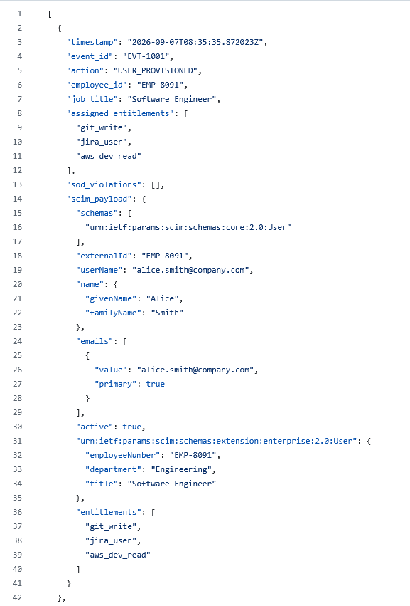

# Enterprise Identity Governance & Administration (IGA) Engine


An automated Identity Governance & Administration engine designed to model the employee lifecycle (Joiner, Mover, Leaver), enforce Role-Based Access Control (RBAC), generate standardized SCIM 2.0 provisioning bodies, and detect Segregation of Duties (SoD) risk violations.

## Architecture & Lifecycle Workflow

```
[ HR Feed Event ] ──> [ IGA Engine ] ──> [ Evaluate RBAC Mapping ]
│
├──> [ Check SoD Toxic Pairs ] ──> Flag Violations
│
└──> [ Generate SCIM 2.0 Payload ] ──> Log to audit_log.json
```

## Core Functionality

* **Identity Lifecycle Automation**: Handles **Joiner** (provisioning), **Mover** (role transition & entitlement cleanup), and **Leaver** (deprovisioning) triggers.
* **Role-Based Access Control (RBAC)**: Maps job titles to granular application entitlements via `config/rbac_roles.json`.
* **Segregation of Duties (SoD) Risk Engine**: Evaluates privilege combinations against `config/sod_matrix.json` to prevent toxic combinations (e.g., code commit rights paired with production administration access).
* **SCIM 2.0 Payload Generation**: Produces standards-compliant identity payloads ready for automated provisioning to Cloud Identity Providers (IdPs).

## Segregation of Duties (SoD) Matrix

| Rule ID | Conflict Name | Toxic Entitlement Pair | Severity | Risk Description |
| :--- | :--- | :--- | :--- | :--- |
| **SOD-001** | Accounts Payable Segregation | `accounts_payable_entry` + `accounts_payable_approve` | HIGH | User cannot create and approve financial payouts. |
| **SOD-002** | Production Code Deployment | `git_write` + `aws_prod_admin` | CRITICAL | User cannot hold source code write access and full production infrastructure control simultaneously. |

## Sample Audit Log Output (`output/audit_log.json`)

Below is a truncated sample of the automated compliance trail generated during the **Mover** phase, capturing the detected **SOD-002** violation alongside the generated **SCIM 2.0** payload:

```
json
{
  "timestamp": "2026-09-07T08:30:00Z",
  "event_id": "EVT-1002",
  "action": "USER_ROLE_TRANSITION",
  "employee_id": "EMP-8091",
  "new_job_title": "DevOps Engineer",
  "sod_violations_detected": [
    {
      "rule_id": "SOD-002",
      "rule_name": "Production Code Deployment",
      "severity": "CRITICAL",
      "conflict_detected": ["git_write", "aws_prod_admin"],
      "description": "User cannot write raw application code AND possess full administrative access to production AWS infrastructure."
    }
  ],
  "scim_payload": {
    "schemas": ["urn:ietf:params:scim:schemas:core:2.0:User"],
    "externalId": "EMP-8091",
    "userName": "alice.smith@company.com",
    "active": true,
    "entitlements": ["git_admin", "jira_user", "aws_prod_admin", "k8s_admin"]
  }
}
```

## How to Run

1. Clone the repository:

```
git clone [https://github.com/SamSong538/enterprise-identity-governance.git](https://github.com/SamSong538/enterprise-identity-governance.git)
cd enterprise-identity-governance
```

2. Execute the engine:

```
python3 iga_engine.py
```
3. Review the generated audit log in output/audit_log.json.

## Audit Log Evidence & Sample Output

